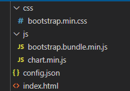
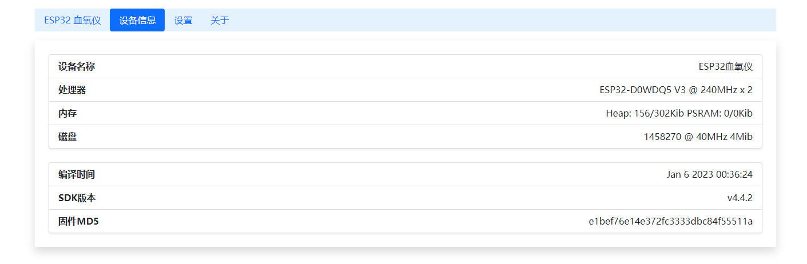

# ESP32 MAX30102 Web血氧仪

一个基于ESP32的MAX3010X Web血氧仪

本项目的心率和血氧计算和驱动代码来之以下项目：

https://github.com/coniferconifer/ESP32_MAX30102_simple-SpO2_plotter

本项目在上面项目的基础上进行重构，增加了Fat文件系统，允许用户使用FTP管理文件系统上传网页前端；并使用Bootstrap + ChartJS重新对前端程序进行设计，增加历史图表曲线功能，并对手机移动端进行了适配


## 注意 Attention

不对本项目的心率和血氧读数精度作出任何保障，不对本项目的稳定性和可靠性负责，不对本项目引发的健康问题负责，不能直接将本项目作为医疗产品使用，绝不对本项目提供任何担保。本项目的说明文档如果出现歧义以中文版本为准。

## 背景 Background

在新冠疫情开放后的非常时期，您需要时刻监视您和您的家人的身体状况,以最大程度预防紧急情况发生，您迫切地需要一个血氧仪来监视血氧和心率的情况，但很不幸地网上血氧仪的价格已经被奸商和黄牛炒得水涨船高，您即使咬牙买下，却仍旧面临交易成功后被商家单方毁约、始终不发货、发货中途快递退回等问题。为了家人的健康，现在您不得不寻求万能的Internet帮助并马上动手现场手搓一个血氧仪。

## 开源代码使用情况 和 许可证 License

注意：本项目的不同部分使用不同开源协议！若没有明确说明，则使用Apache-2.0协议。
<html>
<div>
    <table class="table table-striped table-hover">
        <thead>
            <tr>
                <th scope="col">名称 Name</th>
                <th scope="col">开源协议 License</th>
                <th scope="col">备注 Note</th>
                <th scope="col">链接 Link</th>
            </tr>
        </thead>
        <tbody>
            <tr>
                <td>ESP32_MAX30102_simple-SpO2_plotter</td>
                <td>Apache-2.0</td>
                <td>使用在cal_BPM_SpO2.c血氧核心计算部分</td>
                <td>https://github.com/coniferconifer/ESP32_MAX30102_simple-SpO2_plotter</td>
            </tr>
            <tr>
                <td>SparkFun_MAX3010x_Pulse_and_Proximity_Sensor_Library</td>
                <td>CC BY-SA 4.0 和 MIT</td>
                <td>MAX3010X驱动程序</td>
                <td>https://github.com/sparkfun/SparkFun_MAX3010x_Sensor_Library</td>
            </tr>
            <tr>
                <td>ArduinoJson</td>
                <td>MIT</td>
                <td>用于处理JSON</td>
                <td>https://arduinojson.org/</td>
            </tr>
            <tr>
                <td>SimpleFTPServer</td>
                <td>MIT</td>
                <td>提供FTP文件管理服务</td>
                <td>https://github.com/xreef/SimpleFTPServer</td>
            </tr>
            <tr>
                <td>Bootstrap</td>
                <td>Apache-2.0</td>
                <td>前端CSS框架</td>
                <td>https://github.com/twbs/bootstrap</td>
            </tr>
            <tr>
                <td>ChartJS</td>
                <td>MIT</td>
                <td>提供前端图表绘制</td>
                <td>https://www.chartjs.org/</td>
            </tr>
            <tr>
                <td>IconPark</td>
                <td>Apache-2.0</td>
                <td>提供两个前端图标</td>
                <td>https://github.com/bytedance/IconPark</td>
            </tr>
        </tbody>
    </table>
</div>
</html>

您如果发现本项目存在开源许可证使用不正确问题或者开源代码使用情况公示存在遗漏问题，还请您联系本项目开发者，我们将及时处理开源代码混合许可证可能存在的使用问题。

## 硬件连接

默认引脚连接可以在main.h进行修改
| MAX30102 | ESP32 |
| -------- | ----- |
| 3V3      | 3V3   |
| GND      | GND   |
| SCL      | 22    |
| SDA      | 21    |

## 编译安装(略)

Vscode使用PlatformIO编译并下载程序

分区表请选择: default_ffat.csv

将程序下载到ESP32并重启后，ESP32默认将启用一个名为"ESP32血氧仪"的Wifi热点，并在21端口启动FTP服务器（匿名登陆）

ESP32的默认地址为192.168.4.1

## config.json 配置文件

在本项目的web文件夹下面，存放一个config.json文件，为ESP32的配置文件，文件内容如下

```
{
    "STA_ssid": "你的Wifi名称",
    "STA_passwd": "你的Wifi密码",
    "AP_ssid": "ESP32血氧仪",
    "AP_passwd": ""
}
```
你可以通过修改该文件，并通过FTP上传到ESP32 文件系统根目录，重启ESP32达到配网的目的


## 使用FTP工具部署网页

请将本项目下面的Web文件夹内所有内容复制到

ftp://192.168.4.1/

的根目录，完成后你的ESP32 FTP根目录结构应该如下图所示



FTP默认匿名登陆

## 打开前端页面

如果你使用ESP32开启的Wifi AP热点，可以通过以下链接打开前端页面
http://192.168.4.1

如果你完成配网，并且ESP32成功连接到你的Wifi，则需要到你的路由器后台查看ESP32的IP地址

前端界面如下图所示:





## Q&A

### Q: FTP无法打开

A: 请检查访问的FTP地址是否正确


### Q: FTP复制文件中途发生错误

A: 如果使用Windows自带的文件管理器，可以尝试逐个文件手动复制。推荐使用WinSCP等FTP工具进行文件复制

### Q: FTP中真实存在文件，但是看不到目录结构

A: ESP32的 Ffat 文件系统可能损坏，可以编程ESP32格式化文件系统，或者使用flash_download_tools完整擦除ESP32，再重新安装本程序来解决问题

### Q: MAX30105 无法正常使用

A: 您需要在cal_BPM_SpO2.h中修改代码

```
//CUSTOM DEFINITION
//#define MAX30105 //if you have Sparkfun's MAX30105 breakout board , try #define MAX30105
```

为

```
//CUSTOM DEFINITION
#define MAX30105 //if you have Sparkfun's MAX30105 breakout board , try #define MAX30105
```

然后重新编译代码并下载到ESP32中，关于该部分的解释请查看

https://github.com/coniferconifer/ESP32_MAX30102_simple-SpO2_plotter

